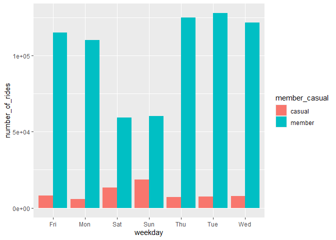

Cyclistic - A Case Study
================
Prasanna Sriram
2024-09-03

- [**Data Collection and
  Preparation**](#data-collection-and-preparation)
- [**Data Processing**](#data-processing)
- [**Data Analysis**](#data-analysis)
- [**Data Visualizations**](#data-visualizations)

A case study to answer business questions of a fictional bike sharing
company - Cyclistic. The goal of the study is to answer questions raised
by Marketing team.

The main question to analyze was how the annual members and casual
riders used the Cyclistic bikes differently.

### **Data Collection and Preparation**

We will be using **Cyclistic’s historical data**. This is publicly
available data. We verified the integrity and privacy of the data
collected. The key tasks that were performed during this step was:

- Download the data
- Identify how it’s organized
- Sort and filter the data
- Determine the credibility of the data

### **Data Processing**

In this step, we processed the data using **R Studio**. The following
steps were performed

- Checked data for errors. We noted that the data from different files
  were stored under different column names.
- We noticed that some of the data were stored as different data types.
- Removed unwanted columns in the datasets.
- Combined all the datasets to make a single dataset.
- Transformed data in certain columns to remove repeated values.
- Created separate columns for year, month and days to analyze the data
  more effectively.
- Removed bad data which had negative ride length values.

<!-- -->

    ##     X  ride_id          started_at            ended_at rideable_type
    ## 1   1 21742443 2019-01-01 00:04:37 2019-01-01 00:11:07          2167
    ## 2   2 21742444 2019-01-01 00:08:13 2019-01-01 00:15:34          4386
    ## 3   3 21742445 2019-01-01 00:13:23 2019-01-01 00:27:12          1524
    ## 4   4 21742446 2019-01-01 00:13:45 2019-01-01 00:43:28           252
    ## 5   5 21742447 2019-01-01 00:14:52 2019-01-01 00:20:56          1170
    ## 6   6 21742448 2019-01-01 00:15:33 2019-01-01 00:19:09          2437
    ## 7   7 21742449 2019-01-01 00:16:06 2019-01-01 00:19:03          2708
    ## 8   8 21742450 2019-01-01 00:18:41 2019-01-01 00:20:21          2796
    ## 9   9 21742451 2019-01-01 00:18:43 2019-01-01 00:47:30          6205
    ## 10 10 21742452 2019-01-01 00:19:18 2019-01-01 00:24:54          3939
    ## 11 11 21742453 2019-01-01 00:20:34 2019-01-01 00:35:20          6243
    ## 12 12 21742454 2019-01-01 00:21:52 2019-01-01 00:32:45          6300
    ## 13 13 21742455 2019-01-01 00:23:04 2019-01-01 00:33:05          3029
    ## 14 14 21742456 2019-01-01 00:23:43 2019-01-01 00:33:05            84
    ## 15 15 21742457 2019-01-01 00:23:54 2019-01-01 00:39:00          5019
    ##    start_station_id                  start_station_name end_station_id
    ## 1               199              Wabash Ave & Grand Ave             84
    ## 2                44              State St & Randolph St            624
    ## 3                15                Racine Ave & 18th St            644
    ## 4               123      California Ave & Milwaukee Ave            176
    ## 5               173 Mies van der Rohe Way & Chicago Ave             35
    ## 6                98          LaSalle St & Washington St             49
    ## 7                98          LaSalle St & Washington St             49
    ## 8               211              St. Clair St & Erie St            142
    ## 9               150          Fort Dearborn Dr & 31st St            148
    ## 10              268          Lake Shore Dr & North Blvd            141
    ## 11              299              Halsted St & Roscoe St            295
    ## 12              204         Prairie Ave & Garfield Blvd            420
    ## 13               90                     Millennium Park            255
    ## 14               90                     Millennium Park            255
    ## 15              289               Wells St & Concord Ln            324
    ##                  end_station_name member_casual       date month day year
    ## 1       Milwaukee Ave & Grand Ave        member 2019-01-01     1   1 2019
    ## 2  Dearborn St & Van Buren St (*)        member 2019-01-01     1   1 2019
    ## 3   Western Ave & Fillmore St (*)        member 2019-01-01     1   1 2019
    ## 4               Clark St & Elm St        member 2019-01-01     1   1 2019
    ## 5         Streeter Dr & Grand Ave        member 2019-01-01     1   1 2019
    ## 6         Dearborn St & Monroe St        member 2019-01-01     1   1 2019
    ## 7         Dearborn St & Monroe St        member 2019-01-01     1   1 2019
    ## 8            McClurg Ct & Erie St        member 2019-01-01     1   1 2019
    ## 9              State St & 33rd St        member 2019-01-01     1   1 2019
    ## 10         Clark St & Lincoln Ave        member 2019-01-01     1   1 2019
    ## 11           Broadway & Argyle St        member 2019-01-01     1   1 2019
    ## 12            Ellis Ave & 55th St        member 2019-01-01     1   1 2019
    ## 13     Indiana Ave & Roosevelt Rd        member 2019-01-01     1   1 2019
    ## 14     Indiana Ave & Roosevelt Rd        casual 2019-01-01     1   1 2019
    ## 15   Stockton Dr & Wrightwood Ave        member 2019-01-01     1   1 2019
    ##    day_of_week ride_length
    ## 1      Tuesday         390
    ## 2      Tuesday         441
    ## 3      Tuesday         829
    ## 4      Tuesday        1783
    ## 5      Tuesday         364
    ## 6      Tuesday         216
    ## 7      Tuesday         177
    ## 8      Tuesday         100
    ## 9      Tuesday        1727
    ## 10     Tuesday         336
    ## 11     Tuesday         886
    ## 12     Tuesday         653
    ## 13     Tuesday         601
    ## 14     Tuesday         562
    ## 15     Tuesday         906

### **Data Analysis**

The key tasks for this stage were

- Aggregation of data so that it’s useful and accessible.
- Organizing and formatting of the data.
- Performing the necessary calculations.
- Identifying trends and relationships.

We primarily analyzed two factors

#### **Average Ride length of Casual v/s Members by day**

    ##     X all_trips_v2.member_casual all_trips_v2.day_of_week
    ## 1   1                     casual                   Sunday
    ## 2   2                     member                   Sunday
    ## 3   3                     casual                   Monday
    ## 4   4                     member                   Monday
    ## 5   5                     casual                  Tuesday
    ## 6   6                     member                  Tuesday
    ## 7   7                     casual                Wednesday
    ## 8   8                     member                Wednesday
    ## 9   9                     casual                 Thursday
    ## 10 10                     member                 Thursday
    ## 11 11                     casual                   Friday
    ## 12 12                     member                   Friday
    ## 13 13                     casual                 Saturday
    ## 14 14                     member                 Saturday
    ##    all_trips_v2.ride_length
    ## 1                 5061.3044
    ## 2                  972.9383
    ## 3                 4752.0504
    ## 4                  822.3112
    ## 5                 4561.8039
    ## 6                  769.4416
    ## 7                 4480.3724
    ## 8                  711.9838
    ## 9                 8451.6669
    ## 10                 707.2093
    ## 11                6090.7373
    ## 12                 796.7338
    ## 13                4950.7708
    ## 14                 974.0730

#### **Average Ride time of Casual v/s Members by day**

    ##     X member_casual weekday number_of_rides average_duration
    ## 1   1        casual     Sun           18652        5061.3044
    ## 2   2        casual     Mon            5591        4752.0504
    ## 3   3        casual     Tue            7311        4561.8039
    ## 4   4        casual     Wed            7690        4480.3724
    ## 5   5        casual     Thu            7147        8451.6669
    ## 6   6        casual     Fri            8013        6090.7373
    ## 7   7        casual     Sat           13473        4950.7708
    ## 8   8        member     Sun           60197         972.9383
    ## 9   9        member     Mon          110430         822.3112
    ## 10 10        member     Tue          127974         769.4416
    ## 11 11        member     Wed          121902         711.9838
    ## 12 12        member     Thu          125228         707.2093
    ## 13 13        member     Fri          115168         796.7338
    ## 14 14        member     Sat           59413         974.0730

### **Data Visualizations**

You can also embed plots, for example:

<!-- -->

<!-- -->
